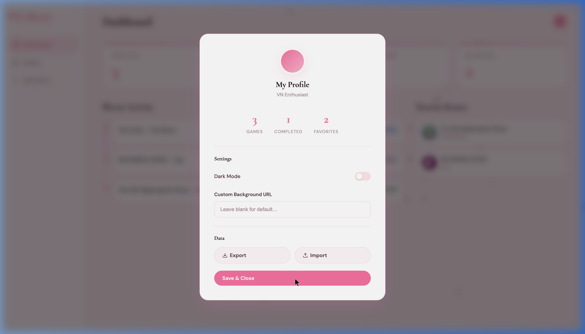
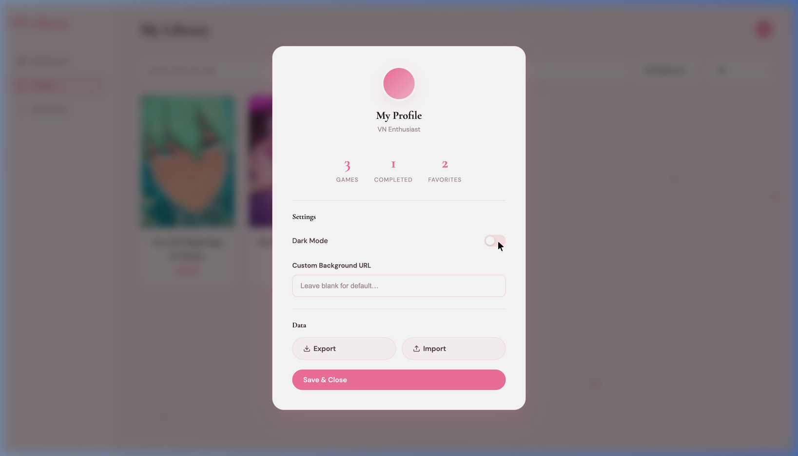
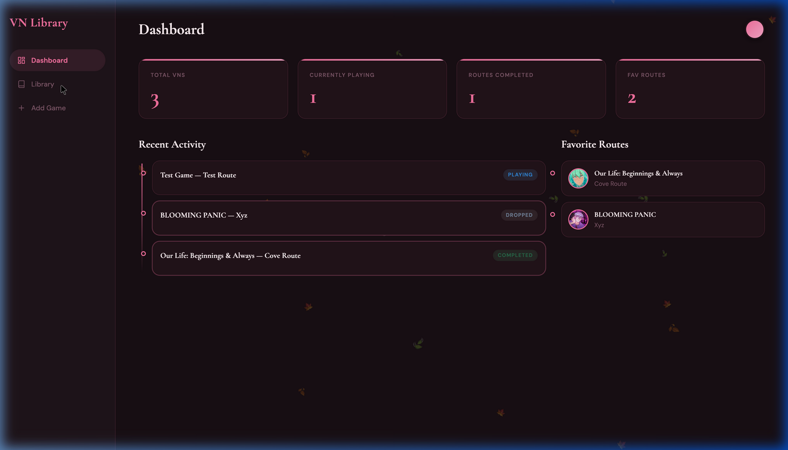
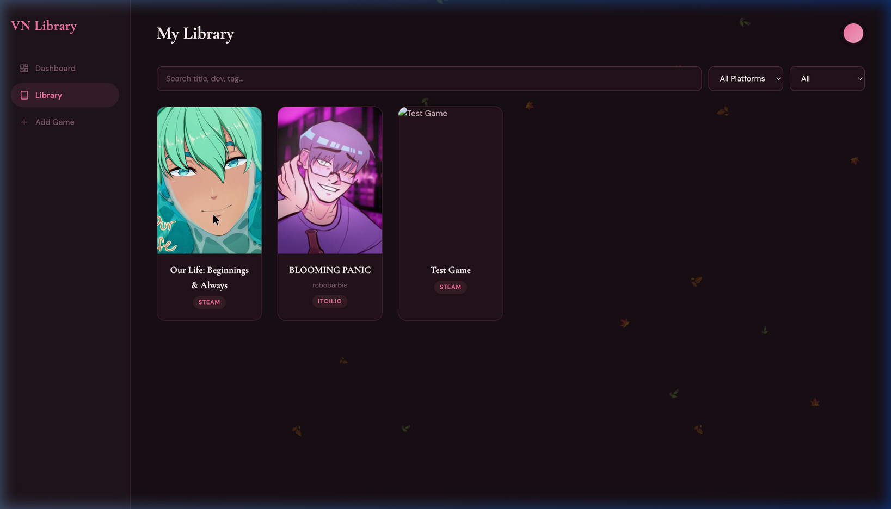
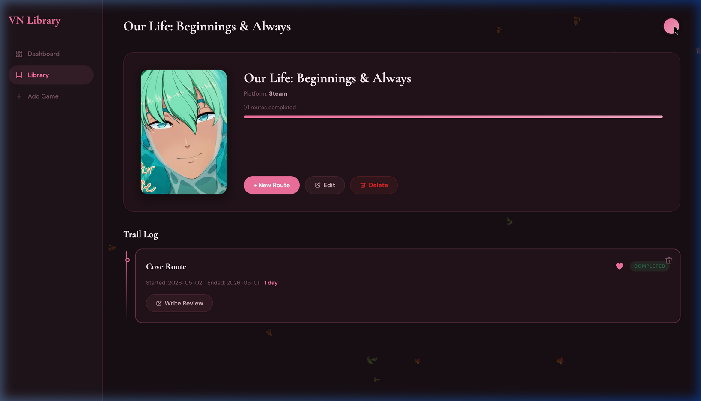
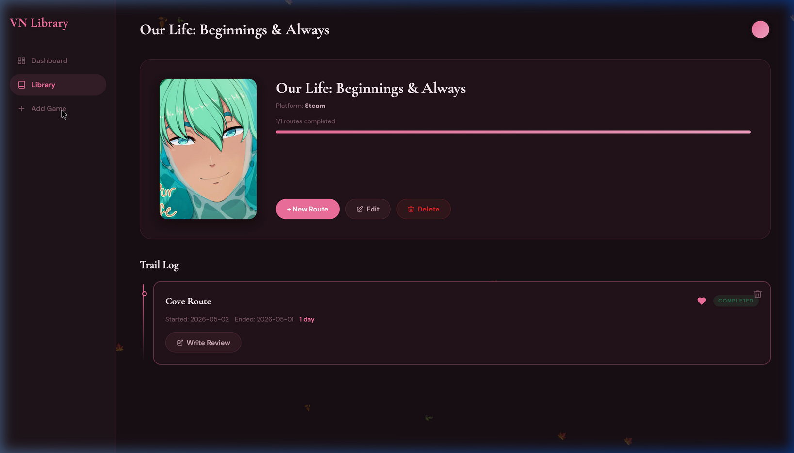

<div align="center">

# 🌸 VN Library

**A personal, beautifully designed Visual Novel tracker — your own Letterboxd for VNs.**

*Track routes. Log characters. Write reviews. Fall in love with your library.*



[](https://developer.mozilla.org/en-US/docs/Web/JavaScript)
[](https://developer.mozilla.org/en-US/docs/Web/API/Window/localStorage)
[](LICENSE)

</div>

---

## ✨ Features

| Feature | Description |
|---|---|
| 📚 **Game Library** | Add VNs with cover art, developer, platform, synopsis, and custom tags |
| 🗺️ **Trail Log** | Track every route/character playthrough with start & end dates |
| 💖 **Route Favorites** | Heart your favorite routes — they appear on your Dashboard |
| ⭐ **Letterboxd-style Reviews** | 5-star ratings, spoiler-blurred text, and a "quick review" on completion |
| 👤 **Character Profiles** | Attach a photo and personal notes to any route log |
| 🎨 **Dark & Light Mode** | Toggleable *Coquette* (light) and *Chic Noir* (dark) themes |
| 🖼️ **Custom Backgrounds** | Set any image URL as a personal background wallpaper |
| 🔍 **Smart Library Filters** | Filter by platform, status (Playing / Completed / Dropped…), or search by title, dev, or tag |
| 📊 **Completion Progress Bar** | Per-game route completion bar in the game detail view |
| 💾 **Data Export / Import** | Backup and restore your entire library as a `.json` file |
| 🍁 **Falling Leaves** | Animated 🍁🍂🍃 leaves gently float across every page |

---

## 📸 Screenshots

<details>
<summary><strong>Light Mode — Dashboard</strong></summary>



</details>

<details>
<summary><strong>Dark Mode — Dashboard</strong></summary>


</details>

<details>
<summary><strong>Library with Filters</strong></summary>



</details>

<details>
<summary><strong>Game Details & Trail Log</strong></summary>



</details>

<details>
<summary><strong>Profile & Settings Modal</strong></summary>



</details>

<details>
<summary><strong>Add Game</strong></summary>



</details>

---

## 🚀 Running Locally

VN Library is a **100% static web app** — no server, no database, no Node.js required. All data lives in your browser's `localStorage`.

### Option 1 — Double-click launch (Mac/Linux) ⭐ Recommended

```bash
# 1. Clone the repo
git clone https://github.com/YOUR_USERNAME/vn-library.git
cd vn-library

# 2. Make the launcher executable (first time only)
chmod +x launch.sh

# 3. Launch!
./launch.sh
```

The script spins up Python's built-in HTTP server, picks a free port, and opens your browser automatically. Press `Ctrl+C` in the terminal to stop.

### Option 2 — Python one-liner

```bash
cd vn-library
python3 -m http.server 8080
# Then open http://127.0.0.1:8080 in your browser
```

### Option 3 — VS Code Live Server

Install the [Live Server](https://marketplace.visualstudio.com/items?itemName=ritwickdey.LiveServer) extension, right-click `index.html`, and choose **Open with Live Server**.

---

## 🍎 Make it a Mac App (click-to-open, no terminal)

You can wrap the launcher into a native `.app` using **Automator** so it lives in your Dock or Applications folder:

1. Open **Automator** (search Spotlight: `Automator`)
2. Choose **New Document → Application**
3. Search for **"Run Shell Script"** and drag it into the workflow
4. Paste this into the script box (update the path to match where you cloned the repo):

```bash
cd /path/to/vn-library
./launch.sh
```

5. Go to **File → Save** and name it `VN Library`
6. Move the saved `.app` to `/Applications` or drag it to your Dock

Now you can open VN Library like any other Mac app! 🎉

---

## 📂 File Structure

```
vn-library/
├── index.html          # App shell & navigation
├── styles.css          # All styling (light + dark tokens, animations)
├── app.js              # All app logic, routing, and localStorage
├── launch.sh           # One-click local launcher script
└── docs/
    └── screenshots/    # README screenshots
```

---

## 💾 Data & Backup

All your data is stored in your browser's `localStorage` under the key `vnTrackerData`. This means:

- ✅ Works fully offline
- ✅ Persists between browser sessions
- ⚠️ Data is **browser-specific** — clearing browser data will erase it

**To back up or move your data:**
1. Click the avatar icon (top right) to open Profile & Settings
2. Click **Export** — this downloads a `.json` file of all your games, routes, and reviews
3. On a new device/browser, use **Import** to restore it

---

## 🛠️ Tech Stack

- **HTML5** — semantic structure
- **Vanilla CSS** — custom properties, animations, dark mode via `[data-theme]`
- **Vanilla JavaScript** — zero dependencies, zero build step
- **Google Fonts** — [Cormorant Garamond](https://fonts.google.com/specimen/Cormorant+Garamond) (headings) + [DM Sans](https://fonts.google.com/specimen/DM+Sans) (body)

---

## 🌸 Credits

Built with love for the VN community. Inspired by [Letterboxd](https://letterboxd.com/).

> *"Every route is a story worth remembering."*
